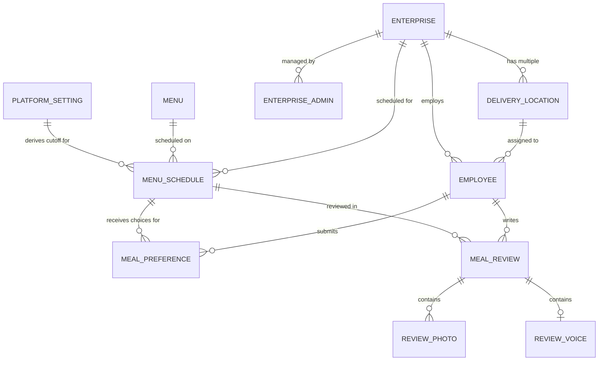

# Data Models & Database Schema
## Aamish (আমিষ) Platform

---

## 1. Entity-Relationship Diagram (ERD)



---

## 2. Table Specifications & Schema Definitions

### 2.0 `platform_settings`
Stores singleton Aamish-wide operational settings. Beta 0.3 introduces the `MEAL_CUTOFF` row with a default local value of `00:05` and timezone `Asia/Dhaka`. Updating it recalculates `menu_schedules.cutoff_time` for every service whose `schedule_date` is the current Dhaka date or later; older rows remain historical snapshots.

| Column | Type | Constraints | Description |
| :--- | :--- | :--- | :--- |
| `key` | `VARCHAR(100)` | `PRIMARY KEY` | Stable setting key, initially `MEAL_CUTOFF` |
| `value` | `JSONB` | `NOT NULL` | Validated value such as `{ "local_time": "00:05", "timezone": "Asia/Dhaka" }` |
| `updated_by_user_id` | `UUID` | `REFERENCES app_users(id)` | Last authorized Super Admin actor |
| `created_at` | `TIMESTAMPTZ` | `DEFAULT NOW()` | Creation timestamp |
| `updated_at` | `TIMESTAMPTZ` | `DEFAULT NOW()` | Last update timestamp |

### 2.1 `enterprises`
Stores company/client profiles onboarding onto the Aamish platform.

| Column | Type | Constraints | Description |
| :--- | :--- | :--- | :--- |
| `id` | `UUID` | `PRIMARY KEY, DEFAULT gen_random_uuid()` | Unique Enterprise ID |
| `name` | `VARCHAR(255)` | `NOT NULL` | Company Name (e.g. "Live Technologies") |
| `slug` | `VARCHAR(100)` | `UNIQUE, NOT NULL` | URL slug (e.g. "live-technologies") |
| `logo_url` | `TEXT` | `NULLABLE` | URL to hosted enterprise logo |
| `poc_name` | `VARCHAR(255)` | `NOT NULL` | Main Point of Contact Name (e.g. Head of Admin) |
| `poc_phone` | `VARCHAR(50)` | `NOT NULL` | POC Contact Phone Number |
| `poc_email` | `VARCHAR(255)` | `NOT NULL` | POC Corporate Email |
| `poc_designation`| `VARCHAR(100)` | `NULLABLE` | POC Role/Title |
| `billing_address`| `TEXT` | `NULLABLE` | Official Billing Address |
| `status` | `VARCHAR(50)` | `DEFAULT 'ACTIVE'` | `ACTIVE`, `SUSPENDED`, `TRIAL` |
| `created_at` | `TIMESTAMPTZ` | `DEFAULT NOW()` | Record creation timestamp |
| `updated_at` | `TIMESTAMPTZ` | `DEFAULT NOW()` | Record update timestamp |

---

### 2.2 `delivery_locations`
Specific physical branches or delivery points for an enterprise where meals are dropped off.

| Column | Type | Constraints | Description |
| :--- | :--- | :--- | :--- |
| `id` | `UUID` | `PRIMARY KEY, DEFAULT gen_random_uuid()` | Unique Location ID |
| `enterprise_id` | `UUID` | `NOT NULL, REFERENCES enterprises(id) ON DELETE CASCADE` | Associated Enterprise |
| `name` | `VARCHAR(255)` | `NOT NULL` | Location / Branch Name (e.g. "Notun Bazar Branch") |
| `code` | `VARCHAR(50)` | `NOT NULL` | Branch code (e.g. "NB-01", "UK-02") |
| `address` | `TEXT` | `NOT NULL` | Detailed drop-off address |
| `contact_person`| `VARCHAR(255)` | `NULLABLE` | Floor in-charge / receiving contact |
| `contact_phone` | `VARCHAR(50)` | `NULLABLE` | Receiving contact phone |
| `is_active` | `BOOLEAN` | `DEFAULT TRUE` | Active branch indicator |
| `created_at` | `TIMESTAMPTZ` | `DEFAULT NOW()` | Creation timestamp |

---

### 2.3 `enterprise_admins`
Admin user accounts for client enterprise HR / Office Managers.

| Column | Type | Constraints | Description |
| :--- | :--- | :--- | :--- |
| `id` | `UUID` | `PRIMARY KEY, DEFAULT gen_random_uuid()` | Unique Admin ID |
| `enterprise_id` | `UUID` | `NOT NULL, REFERENCES enterprises(id) ON DELETE CASCADE` | Associated Enterprise |
| `full_name` | `VARCHAR(255)` | `NOT NULL` | Admin Full Name |
| `email` | `VARCHAR(255)` | `UNIQUE, NOT NULL` | Login Email |
| `phone` | `VARCHAR(50)` | `NULLABLE` | Contact Phone Number |
| `password_hash` | `TEXT` | `NOT NULL` | Pre-generated hashed password |
| `role` | `VARCHAR(50)` | `DEFAULT 'ENTERPRISE_ADMIN'` | Role identifier |
| `status` | `VARCHAR(50)` | `DEFAULT 'ACTIVE'` | Account status |
| `created_at` | `TIMESTAMPTZ` | `DEFAULT NOW()` | Creation timestamp |

---

### 2.4 `employees`
Enterprise employee records receiving daily meals.

| Column | Type | Constraints | Description |
| :--- | :--- | :--- | :--- |
| `id` | `UUID` | `PRIMARY KEY, DEFAULT gen_random_uuid()` | Unique Database ID |
| `enterprise_id` | `UUID` | `NOT NULL, REFERENCES enterprises(id) ON DELETE CASCADE` | Associated Enterprise |
| `employee_code` | `VARCHAR(100)` | `NOT NULL` | Official Employee ID (e.g. "LIVE-1042") |
| `full_name` | `VARCHAR(255)` | `NOT NULL` | Employee Full Name |
| `email` | `VARCHAR(255)` | `NOT NULL` | Corporate Email Address |
| `phone` | `VARCHAR(50)` | `NULLABLE` | Phone Number |
| `location_id` | `UUID` | `NOT NULL, REFERENCES delivery_locations(id)` | Default Delivery Location |
| `is_active` | `BOOLEAN` | `DEFAULT TRUE` | Active employment status |
| `created_at` | `TIMESTAMPTZ` | `DEFAULT NOW()` | Creation timestamp |
| `updated_at` | `TIMESTAMPTZ` | `DEFAULT NOW()` | Last updated timestamp |

*Composite Unique Constraint*: `UNIQUE (enterprise_id, employee_code)`

---

### 2.5 `menus`
Master catalog of food packages / meal offerings created by Aamish Kitchen & Ops.

| Column | Type | Constraints | Description |
| :--- | :--- | :--- | :--- |
| `id` | `UUID` | `PRIMARY KEY, DEFAULT gen_random_uuid()` | Unique Menu Item ID |
| `title` | `VARCHAR(255)` | `NOT NULL` | Menu Title (e.g. "Bengali Polao & Sonali Roast") |
| `slug` | `VARCHAR(255)` | `UNIQUE, NOT NULL` | URL safe slug |
| `description` | `TEXT` | `NOT NULL` | Description of dishes, sides, and accompaniments |
| `category` | `VARCHAR(50)` | `DEFAULT 'REGULAR_LUNCH'` | `REGULAR_LUNCH`, `PREMIUM`, `VEGETARIAN` |
| `price` | `DECIMAL(10,2)` | `DEFAULT 0.00` | Baseline unit price (BDT) for future billing |
| `image_desktop_url` | `TEXT` | `NOT NULL` | High-resolution image URL |
| `image_mobile_url` | `TEXT` | `NOT NULL` | Compressed, responsive mobile image URL |
| `status` | `VARCHAR(50)` | `DEFAULT 'DRAFT'` | `DRAFT`, `ACTIVE`, `ARCHIVED` |
| `created_at` | `TIMESTAMPTZ` | `DEFAULT NOW()` | Creation timestamp |

---

### 2.6 `menu_schedules`
Defines which menu is active for a specific date, enterprise, and cutoff window.

| Column | Type | Constraints | Description |
| :--- | :--- | :--- | :--- |
| `id` | `UUID` | `PRIMARY KEY, DEFAULT gen_random_uuid()` | Unique Schedule ID |
| `enterprise_id` | `UUID` | `NOT NULL, REFERENCES enterprises(id) ON DELETE CASCADE` | Associated Enterprise |
| `menu_id` | `UUID` | `NOT NULL, REFERENCES menus(id)` | Scheduled Menu |
| `schedule_date` | `DATE` | `NOT NULL` | Target Meal Date (e.g. `2026-08-31`) |
| `meal_type` | `VARCHAR(50)` | `DEFAULT 'LUNCH'` | `LUNCH` (MVP fixed to single meal) |
| `cutoff_time` | `TIMESTAMPTZ` | `NOT NULL` | Strict locking cutoff timestamp |
| `status` | `VARCHAR(50)` | `DEFAULT 'PUBLISHED'` | `DRAFT`, `PUBLISHED`, `LOCKED`, `COMPLETED` |
| `created_at` | `TIMESTAMPTZ` | `DEFAULT NOW()` | Creation timestamp |

*Composite Unique Constraint*: `UNIQUE (enterprise_id, schedule_date, meal_type)`

---

### 2.7 `meal_preferences`
Tracks individual employee meal opt-ins/opt-outs (toggles) for scheduled dates.

| Column | Type | Constraints | Description |
| :--- | :--- | :--- | :--- |
| `id` | `UUID` | `PRIMARY KEY, DEFAULT gen_random_uuid()` | Unique Preference ID |
| `schedule_id` | `UUID` | `NOT NULL, REFERENCES menu_schedules(id) ON DELETE CASCADE` | Associated Schedule |
| `employee_id` | `UUID` | `NOT NULL, REFERENCES employees(id) ON DELETE CASCADE` | Employee |
| `location_id` | `UUID` | `NOT NULL, REFERENCES delivery_locations(id)` | Drop-off Location for that day |
| `is_opted_in` | `BOOLEAN` | `DEFAULT TRUE, NOT NULL` | `TRUE` = Wants Meal; `FALSE` = Toggled OFF (Skip) |
| `updated_by` | `VARCHAR(50)` | `DEFAULT 'EMPLOYEE'` | `EMPLOYEE`, `ENTERPRISE_ADMIN`, `SYSTEM` |
| `last_toggled_at`| `TIMESTAMPTZ`| `DEFAULT NOW()` | Timestamp of last toggle action |

*Composite Unique Constraint*: `UNIQUE (schedule_id, employee_id)`

---

### 2.8 `meal_reviews`
Quality and CSAT feedback submitted by employees.

| Column | Type | Constraints | Description |
| :--- | :--- | :--- | :--- |
| `id` | `UUID` | `PRIMARY KEY, DEFAULT gen_random_uuid()` | Unique Review ID |
| `schedule_id` | `UUID` | `NOT NULL, REFERENCES menu_schedules(id) ON DELETE CASCADE` | Associated Meal Schedule |
| `employee_id` | `UUID` | `NOT NULL, REFERENCES employees(id) ON DELETE CASCADE` | Employee Reviewer |
| `rating` | `INTEGER` | `NOT NULL, CHECK (rating >= 1 AND rating <= 5)` | CSAT Star Rating (1 to 5) |
| `comment` | `TEXT` | `NULLABLE` | Qualitative feedback / notes |
| `review_date` | `DATE` | `NOT NULL` | The meal date being reviewed |
| `is_edited` | `BOOLEAN` | `DEFAULT FALSE` | True if edited after original submission |
| `created_at` | `TIMESTAMPTZ` | `DEFAULT NOW()` | Submission timestamp |
| `updated_at` | `TIMESTAMPTZ` | `DEFAULT NOW()` | Edit timestamp |

*Composite Unique Constraint*: `UNIQUE (schedule_id, employee_id)`

Review submission is allowed for any previous opted-in/received schedule. Employee updates are authorized only while `NOW() < created_at + INTERVAL '24 hours'`. Updating a review never changes `created_at`; after the deadline the record remains readable but employee-immutable.

---

### 2.9 `review_photos`
Uploaded evidence / photos of the meals and food quality.

| Column | Type | Constraints | Description |
| :--- | :--- | :--- | :--- |
| `id` | `UUID` | `PRIMARY KEY, DEFAULT gen_random_uuid()` | Unique Photo ID |
| `review_id` | `UUID` | `NOT NULL, REFERENCES meal_reviews(id) ON DELETE CASCADE` | Parent Review |
| `photo_url` | `TEXT` | `NOT NULL` | URL to hosted food photo |
| `thumbnail_url` | `TEXT` | `NULLABLE` | Fast loading thumbnail URL |
| `caption` | `VARCHAR(255)` | `NULLABLE` | Optional caption (e.g. "Undercooked vegetable") |
| `created_at` | `TIMESTAMPTZ` | `DEFAULT NOW()` | Upload timestamp |

At most five active photo rows may belong to one review.

### 2.10 `review_voice`
Stores the optional voice recording associated with a meal review.

| Column | Type | Constraints | Description |
| :--- | :--- | :--- | :--- |
| `id` | `UUID` | `PRIMARY KEY, DEFAULT gen_random_uuid()` | Unique audio record ID |
| `review_id` | `UUID` | `UNIQUE, NOT NULL, REFERENCES meal_reviews(id) ON DELETE CASCADE` | Parent review; enforces at most one voice recording |
| `cloudinary_public_id` | `TEXT` | `NOT NULL` | Trusted media-provider identifier |
| `audio_url` | `TEXT` | `NOT NULL` | Authorized playback URL |
| `duration_seconds` | `SMALLINT` | `NOT NULL, CHECK (duration_seconds BETWEEN 1 AND 60)` | Recording duration |
| `created_at` | `TIMESTAMPTZ` | `DEFAULT NOW()` | Initial upload timestamp |
| `updated_at` | `TIMESTAMPTZ` | `DEFAULT NOW()` | Replacement timestamp within the edit window |

Review media is returned only through role- and tenant-authorized queries. Employee replacement is allowed only within the parent review's original 24-hour edit window.

---

## 3. Aggregation Query Specifications (Kitchen Matrix)

The Kitchen Aggregation View executes the following SQL query to produce the real-time location breakdown:

```sql
SELECT
    m.title AS menu_name,
    dl.name AS location_name,
    COUNT(mp.id) FILTER (WHERE mp.is_opted_in = TRUE) AS meal_count
FROM menu_schedules ms
JOIN menus m ON ms.menu_id = m.id
JOIN meal_preferences mp ON ms.id = mp.schedule_id
JOIN delivery_locations dl ON mp.location_id = dl.id
WHERE ms.schedule_date = CURRENT_DATE
  AND ms.enterprise_id = :target_enterprise_id
GROUP BY m.title, dl.name
ORDER BY dl.name ASC;
```
