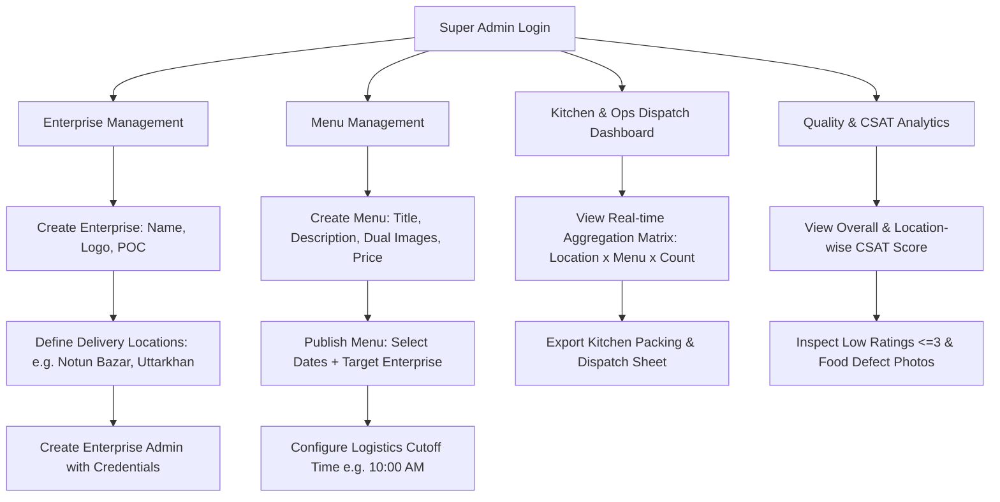
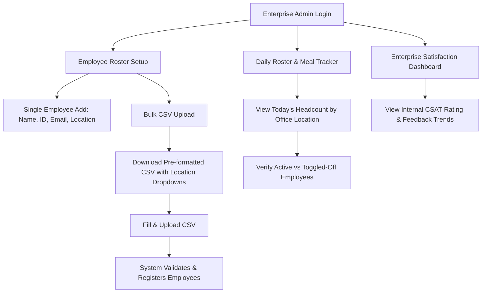
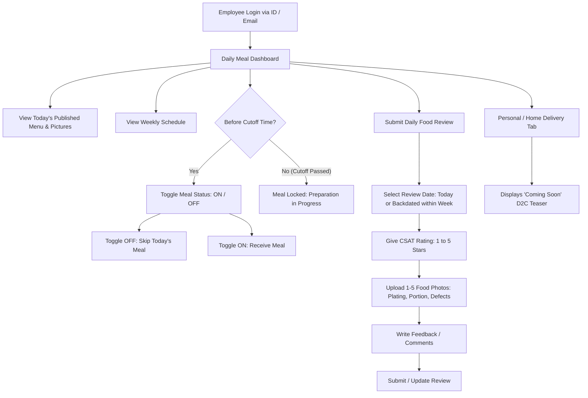
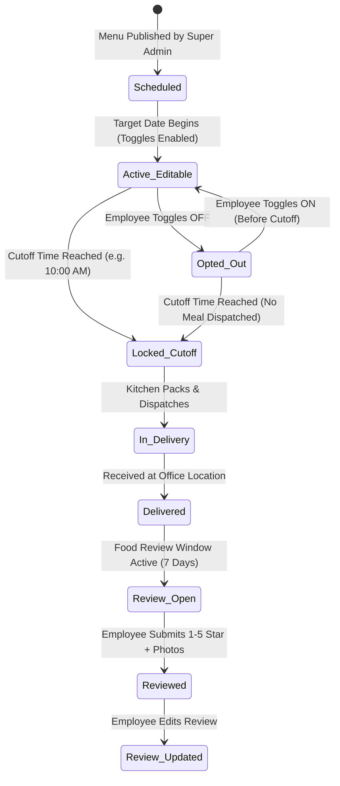

# User Journeys & Workflow Specifications
## Aamish (আমিষ) Platform

---

## 1. Persona Overview

| Persona | Role | Primary Goals | Key Pain Points Solved |
| :--- | :--- | :--- | :--- |
| **Aamish Ops Admin** | Platform Super Admin (Ops / Kitchen / Logistics) | Onboard enterprises, configure delivery hubs, schedule daily menus, enforce cutoff, aggregate kitchen production counts, monitor live CSAT. | Manual headcount tallying over phone/WhatsApp, unpredictable kitchen wastage, no real-time feedback loop. |
| **Enterprise Admin** | HR / Admin POC at Client (e.g., Live Technologies) | Manage employee rosters (single & CSV bulk upload), assign branch locations, monitor daily meal counts delivered to offices. | Managing paper rosters, tracking who is eating at which office, manual coordination with caterers. |
| **Enterprise User** | Employee at Client Company | View today's & weekly meal options, opt-out (toggle off) if out of office before cutoff, submit ratings (1–5 CSAT), upload food photos, and write review notes. | Unpredictable lunch menus, no voice/channel to give immediate feedback on food quality or portion size. |

---

## 2. Journey 1: Aamish Live Super Admin

### 2.1 Step-by-Step Flow

#### Step 1: Enterprise & Location Setup
1. Super Admin logs into the Aamish Platform.
2. Navigates to **Enterprises** $\rightarrow$ clicks **"Create Enterprise"**.
3. Inputs Enterprise details:
   * **Enterprise Name**: e.g., `Live Technologies`
   * **POC Details**: Name, Phone, Email, Designation (e.g., `Head of Procurement`).
   * **Logo**: Upload company logo.
4. Adds official **Delivery Locations**:
   * Location 1: `Notun Bazar Office`
   * Location 2: `Uttarkhan Hub`
   * Location 3: `Baridhara / Boran Facility`
5. Navigates to **Enterprise Admins** $\rightarrow$ clicks **"Create Admin"**:
   * Enters Admin Name, Email, Phone.
   * System assigns pre-generated secure User ID & Password.

#### Step 2: Menu Creation & Publishing
1. Navigates to **Menu Library** $\rightarrow$ clicks **"New Menu Package"**.
2. Fills in Menu attributes:
   * **Title**: e.g., `Special Bhuna Khichuri with Chicken Roast`
   * **Description / Components**: e.g., `Aromatic Chinigura rice khichuri, 1 pc Sonali chicken roast, boiled egg, salad, and laban.`
   * **Price Field**: (Optional baseline / internal billing value e.g. `200 BDT`).
   * **Image Upload**:
     * Uploads high-resolution desktop banner.
     * System automatically processes and stores responsive mobile-optimized compressed thumbnail.
3. Sets Menu Status to `Saved / Draft`.
4. Navigates to **Publish Schedule**:
   * Selects target Date range (e.g., `Mon Aug 31 – Fri Sep 04`).
   * Assigns Menu packages to dates.
   * Sets **Order Cutoff Time** (e.g., `10:00 AM daily` or `05:00 PM previous day`).
   * Clicks **"Publish Schedule"**.

#### Step 3: Kitchen Dispatch & Aggregation
1. On operational day (post-cutoff time):
2. Super Admin opens the **Operations / Dispatch Matrix**.
3. System presents a live, read-only aggregation table:
   * **Row**: Menu Item
   * **Columns**: `Notun Bazar`, `Uttarkhan`, `Baridhara`
   * **Values**: Count of active (non-toggled-off) employee meals.
4. Kitchen prints/exports the packing list for vehicle dispatch.

#### Step 4: Review Monitoring & CSAT Analysis
1. Super Admin opens the **Quality & CSAT Panel**.
2. Monitors average daily rating (1.0 – 5.0 stars) across enterprise locations.
3. Filters for reviews $\le 3$ stars to examine employee comments and inspect uploaded photo evidence (e.g., raw vegetables, portion defects, packaging leaks) for immediate vendor/kitchen remediation.

---

## 3. Journey 2: Enterprise Admin (Client HR / Office Admin)

### 3.1 Step-by-Step Flow

#### Step 1: Login & Initial Setup
1. Enterprise Admin receives pre-generated credentials from Aamish Ops.
2. Logs in via Enterprise Portal URL.
3. Profile displays assigned enterprise (`Live Technologies`) and pre-configured branches (`Notun Bazar`, `Uttarkhan`, `Baridhara`).

#### Step 2: Employee Roster Population
* **Method A: Single Employee Add**:
  * Enters: Employee Full Name, Employee ID (e.g., `LIVE-1042`), Corporate Email, and selects Delivery Location from dropdown.
* **Method B: Bulk Upload**:
  1. Admin clicks **"Download Employee Upload Template (.csv / .xlsx)"**.
  2. Template dynamically populates valid location options for this enterprise.
  3. Admin enters employee rows and uploads the completed file.
  4. System validates entries, flags duplicates or invalid entries, and registers verified accounts.

#### Step 3: Daily Monitoring & Office Headcount Verification
1. Admin views the daily **Branch Meal Summary**.
2. Observes total meal count arriving at each company office for lunch distribution.
3. Reviews company-wide satisfaction scores to track employee sentiment.

---

## 4. Journey 3: Enterprise User (Employee Mobile & Web App)

### 4.1 Step-by-Step Flow

#### Step 1: Login & Dashboard Access
1. Employee navigates to the mobile-friendly web app URL.
2. Enters Employee ID or corporate email.
3. Dashboard prominently renders:
   * Today's Date & Meal Banner (e.g., `Special Chicken Khichuri & Sonali Roast`).
   * High-quality compressed food photo & detailed ingredient list.
   * Live Cutoff Countdown Timer (e.g., `Locks in 01h 42m`).

#### Step 2: Meal Preference & Opt-Out (Toggle Off)
* **Default State**: Employee is set to `Opt-In (Meal ON)`.
* **Action to Skip Meal**:
  * Employee clicks the toggle switch to `OFF`.
  * Status updates immediately to: `Meal Skipped for Today`.
  * Reasons: Remote work, leave, fasting, or personal lunch plans.
* **Cutoff Locking Rule**:
  * When cutoff time arrives (e.g., 10:00 AM), the switch disables and displays: `Locked for kitchen preparation`.

#### Step 3: Daily Quality Feedback & Photo Upload
1. After lunch, employee clicks **"Review Today's Meal"** (or selects a past date from the week if back-reviewing).
2. **Rating**: Selects 1 to 5 stars (CSAT scale).
3. **Photo Evidence**: Uploads 1 to 5 photos directly from mobile camera/gallery (e.g., plating quality, portion size, or defect like undercooked vegetable).
4. **Feedback Note**: Writes optional or required comments (e.g., *"Rice was flavorful, but chicken was slightly salty."*).
5. **Submit**: Review is recorded in real time. Employee can re-open and edit the review if needed.
6. **Gamification Feedback**: Notification displays progress: *"Review 4/22 completed. Keep it up!"*

#### Step 4: D2C (Direct to Consumer) Exploration
1. Employee clicks on the **"Order for Home / Personal"** tab.
2. System displays a clean banner: *"Coming Soon – Enjoy Aamish catering delivered directly to your home."*

---

## 5. State Machine & Cutoff Logic

